# 02. OpenClaw 설치 및 Slack 연동

## 참고 문서

| 문서 | URL | 내용 |
|------|-----|------|
| 홈페이지 | https://openclaw.ai/ | 공식 사이트 |
| Install | https://docs.openclaw.ai/install | 설치 방법 총정리 |
| Getting Started | https://docs.openclaw.ai/start/getting-started | 빠른 시작 가이드 |
| Setup | https://docs.openclaw.ai/start/setup | 개발자/서버 세팅 |

### 시스템 요구사항

- **Node 22+** (설치 스크립트가 없으면 자동 설치)
- macOS, Linux, 또는 Windows
- `pnpm`은 소스 빌드 시에만 필요

---

## 1단계: EC2에 OpenClaw 설치

### EC2 접속

```bash
ssh -i ~/.ssh/glen-openclaw.pem ubuntu@<EC2_ELASTIC_IP>
```

- 인스턴스: t3.medium, Ubuntu 22.04 LTS
- Elastic IP: <EC2_ELASTIC_IP>
- EC2 생성 과정은 [01-ec2-생성.md](./01-ec2-생성.md) 참고

### 설치 스크립트 실행

공식 문서에서 권장하는 원라인 설치 스크립트를 사용한다.

```bash
curl -fsSL https://openclaw.ai/install.sh | bash
```

### 설치 로그

```
🦞 OpenClaw Installer
   Chat automation for people who peaked at IRC.
   modern installer mode

✓ gum bootstrapped (temp, verified, v0.17.0)
✓ Detected: linux

Install plan
  OS                  linux
  Install method      npm
  Requested version   latest

[1/3] Preparing environment
  INFO Node.js not found, installing it now
  INFO Installing Node.js via NodeSource
  INFO Installing Linux build tools (make/g++/cmake/python3)
  ✓ Build tools installed
  ✓ Node.js v22 installed

[2/3] Installing OpenClaw
  ✓ Git already installed
  INFO Configuring npm for user-local installs
  ✓ npm configured for user installs
  INFO Installing OpenClaw v2026.2.13
  ✓ OpenClaw npm package installed
  ✓ OpenClaw installed

[3/3] Finalizing setup

🦞 OpenClaw installed successfully (2026.2.13)!
```

### PATH 설정

설치 후 PATH 경고가 표시된다. `~/.bashrc`에 추가한다:

```bash
export PATH="/home/ubuntu/.npm-global/bin:$PATH"
```

---

## 2단계: 온보딩 위자드

설치 직후 자동으로 온보딩 위자드가 시작된다.

### 2-1. 보안 경고 확인

보안 경고를 읽고 **Yes**를 선택한다.

```
◇  Security warning — please read.
│
│  OpenClaw is a hobby project and still in beta. Expect sharp edges.
│  This bot can read files and run actions if tools are enabled.
│  A bad prompt can trick it into doing unsafe things.
│
│  Recommended baseline:
│  - Pairing/allowlists + mention gating.
│  - Sandbox + least-privilege tools.
│  - Keep secrets out of the agent's reachable filesystem.
│  - Use the strongest available model for any bot with tools or
│    untrusted inboxes.
│
◇  I understand this is powerful and inherently risky. Continue?
│  Yes
```

### 2-2. QuickStart 모드 선택

QuickStart를 선택하면 기본 설정이 자동 적용된다.

```
◇  Onboarding mode
│  QuickStart

◇  QuickStart 설정:
│  Gateway port: 18789
│  Gateway bind: Loopback (127.0.0.1)
│  Gateway auth: Token (default)
│  Tailscale exposure: Off
```

> **참고**: Model check에서 `No auth configured for provider "anthropic"` 경고가 표시된다. AI 모델 인증은 이후에 설정한다.

### 2-3. 채널 선택: Slack (Socket Mode)

```
◇  Select channel (QuickStart)
│  Slack (Socket Mode)

◇  Slack bot display name (used for manifest)
│  nxt-openclaw
```

온보딩 위자드가 Slack 앱 매니페스트 JSON을 자동 생성한다. 이 매니페스트를 Slack API에서 사용한다.

위자드는 이제 Bot Token(`xoxb-...`) 입력을 기다린다. Slack 앱을 먼저 만들어야 한다.

---

## 3단계: Slack 앱 생성

### 3-1. Slack API 접속

https://api.slack.com/apps 에 접속하여 우측 상단 **"Create New App"** 클릭.

### 3-2. From a manifest 선택

팝업에서 **"From a manifest"** 선택. 매니페스트를 사용하면 scopes, events, socket mode 등이 한번에 설정된다.

### 3-3. 워크스페이스 선택

**start-aws** 워크스페이스를 선택하고 **"Next"** 클릭.

> **주의**: 워크스페이스는 나중에 변경할 수 없다.

### 3-4. 매니페스트 입력

JSON 탭에서 기본 내용을 지우고, 아래 매니페스트를 붙여넣는다.

> **주의**: 온보딩 위자드가 자동 생성하는 매니페스트에는 `im:write`, `im:read` scope와 `app_home` 설정이 빠져 있다. 아래는 DM 응답이 정상 동작하도록 **보완한 매니페스트**이다.

```json
{
  "display_information": {
    "name": "nxt-openclaw",
    "description": "OpenClaw Slack bot",
    "background_color": "#FF5A36"
  },
  "features": {
    "bot_user": {
      "display_name": "nxt-openclaw",
      "always_online": true
    },
    "app_home": {
      "messages_tab_enabled": true,
      "messages_tab_read_only_enabled": false
    },
    "slash_commands": [
      {
        "command": "/openclaw",
        "description": "Send a message to OpenClaw",
        "should_escape": false
      }
    ]
  },
  "oauth_config": {
    "scopes": {
      "bot": [
        "chat:write", "channels:history", "channels:read",
        "groups:history",
        "im:history", "im:read", "im:write",
        "mpim:history",
        "users:read", "app_mentions:read",
        "reactions:read", "reactions:write",
        "pins:read", "pins:write", "emoji:read",
        "commands", "files:read", "files:write"
      ]
    }
  },
  "settings": {
    "socket_mode_enabled": true,
    "event_subscriptions": {
      "bot_events": [
        "app_mention", "message.channels", "message.groups",
        "message.im", "message.mpim",
        "reaction_added", "reaction_removed",
        "member_joined_channel", "member_left_channel",
        "channel_rename", "pin_added", "pin_removed"
      ]
    }
  }
}
```

**온보딩 자동 생성 매니페스트와의 차이점:**

| 항목 | 자동 생성 | 보완 후 |
|------|----------|---------|
| `im:write` | 없음 | 추가 (DM 응답에 필수) |
| `im:read` | 없음 | 추가 (DM 채널 정보 조회) |
| `app_home.messages_tab_enabled` | 없음 | `true` (DM 입력창 활성화) |

### 3-5. 앱 생성 완료

**"Create"** 클릭하면 Basic Information 페이지로 이동한다.

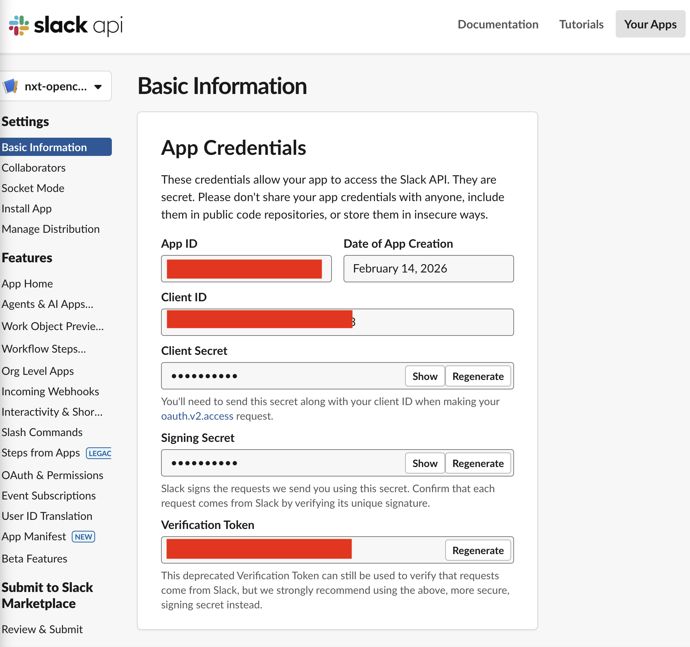

- **App ID**: <APP_ID>
- **생성일**: February 14, 2026

> **보안**: Client Secret, Signing Secret은 절대 외부에 노출하지 않는다.

---

## 4단계: 슬래시 명령어 변경 (충돌 해결)

### 문제

워크스페이스에 이미 다른 앱(Joshua)이 `/openclaw` 명령어를 사용하고 있어 충돌이 발생한다.

### 해결

좌측 메뉴 **Features > Slash Commands**로 이동.

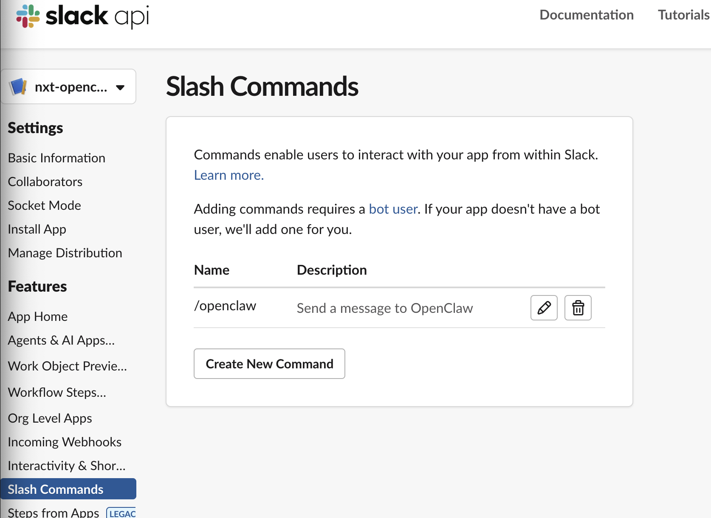

`/openclaw` 옆 연필 아이콘(편집) 클릭 → Command를 `/nxt-openclaw`으로 변경 → **"Save"**.

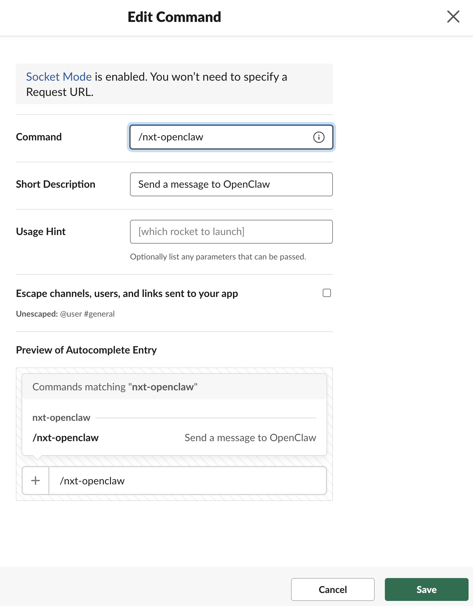

---

## 5단계: 앱 설치 (Bot Token 발급)

좌측 메뉴 **Settings > Install App** → **"Install to start-aws"** 클릭.

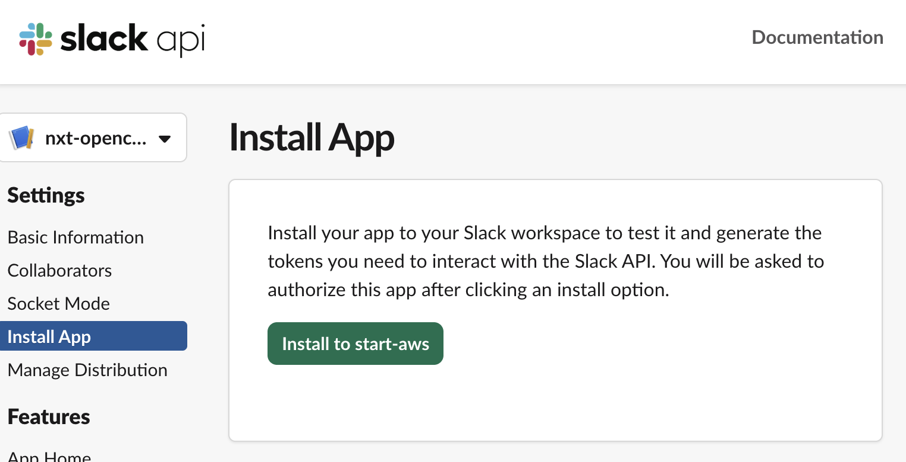

OAuth 권한 승인 화면에서 요청된 권한을 확인하고 **"허용"** 클릭.

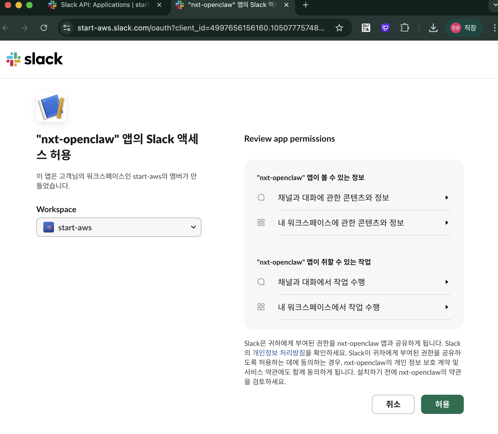

설치 완료 후 **Bot User OAuth Token**(`xoxb-...`)이 발급된다. **"Copy"**로 복사해둔다.

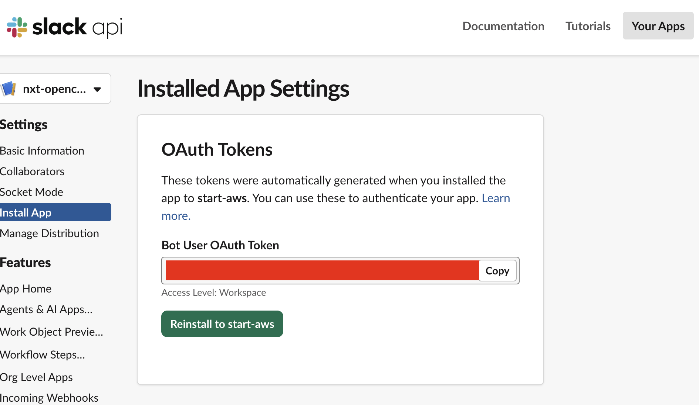

> **보안**: Bot Token은 절대 코드에 하드코딩하지 않는다. 환경변수(`SLACK_BOT_TOKEN`)로 관리한다.

---

## 6단계: App-Level Token 생성 (Socket Mode용)

Socket Mode를 사용하려면 App-Level Token(`xapp-...`)이 필요하다.

### 6-1. Socket Mode 확인

좌측 메뉴 **Settings > Socket Mode**에서 Socket Mode가 **활성화(ON)** 되어 있는지 확인한다.

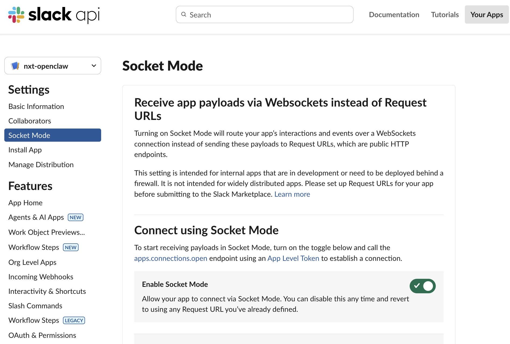

Features affected:

| Feature | Enabled |
|---------|---------|
| Interactivity & Shortcuts | Yes |
| Slash Commands | Yes |
| Event Subscriptions | Yes |

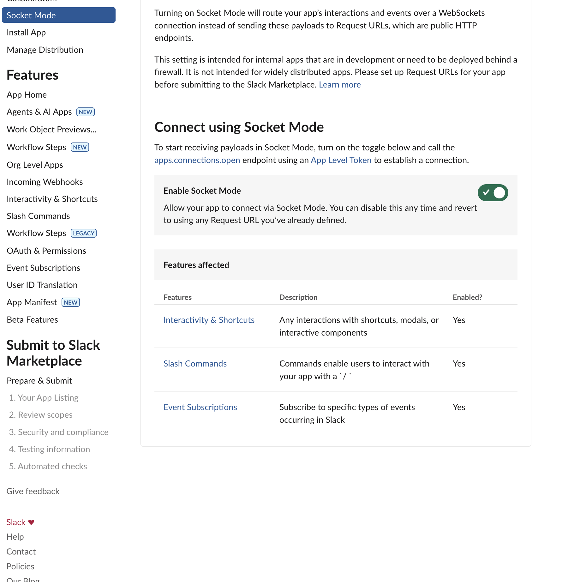

### 6-2. App-Level Token 생성

좌측 메뉴 **Settings > Basic Information** → 하단 **App-Level Tokens** 섹션.

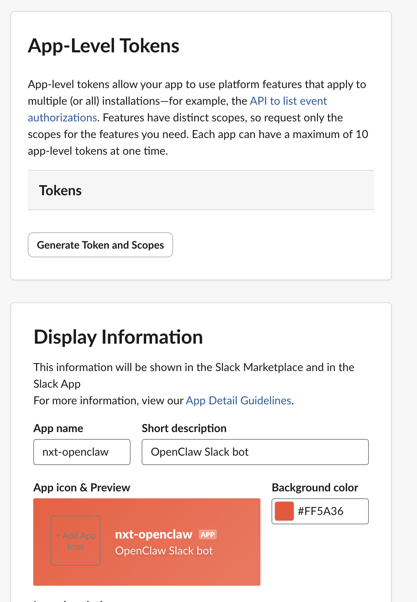

**"Generate Token and Scopes"** 클릭 → 팝업에서:

- **Token Name**: `nxt-openclaw`
- **Scope**: `connections:write` (WebSocket으로 이벤트 수신)

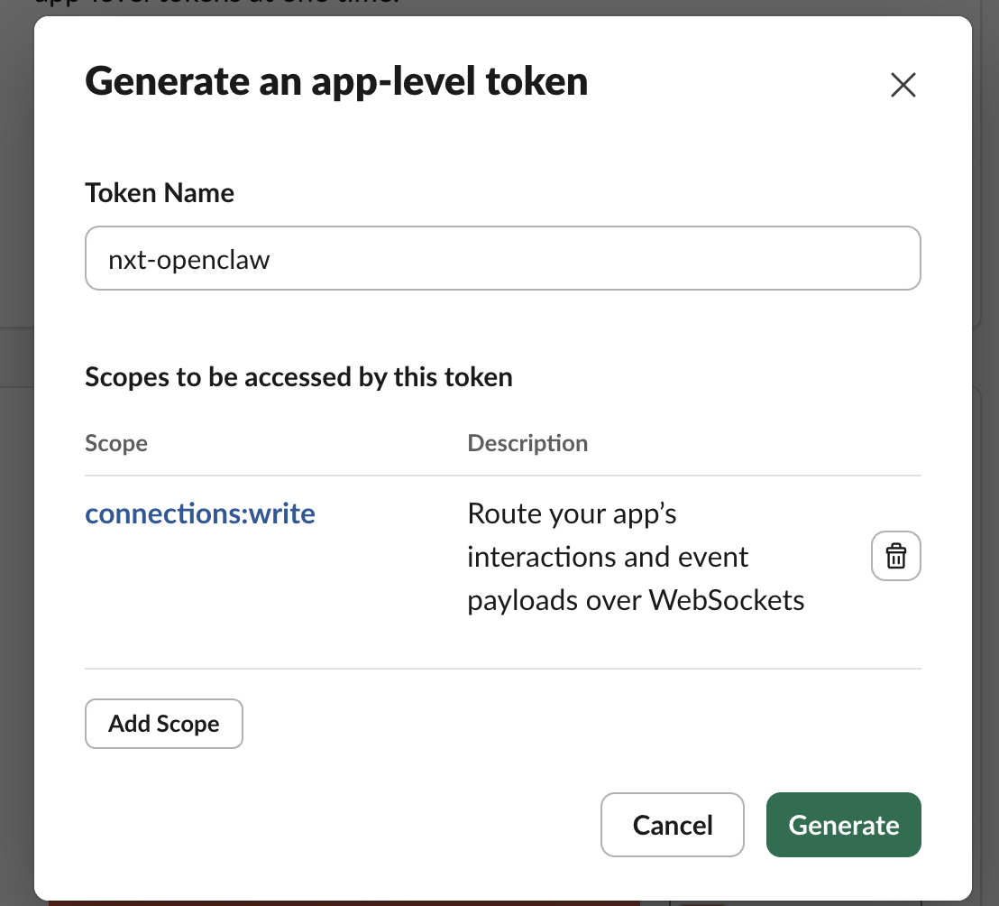

**"Generate"** 클릭하면 토큰이 발급된다. **"Copy"**로 복사해둔다.

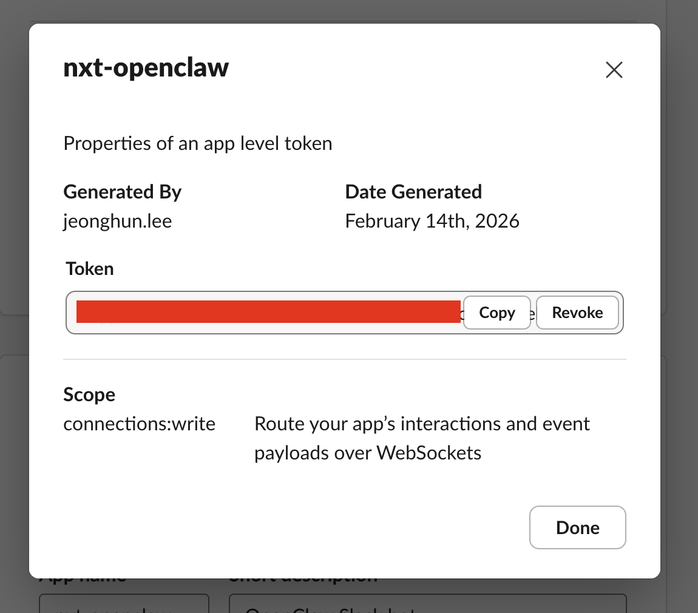

> **보안**: App-Level Token도 환경변수(`SLACK_APP_TOKEN`)로 관리한다.

---

## 7단계: 온보딩 위자드에 토큰 입력

EC2 온보딩 위자드로 돌아가 발급받은 토큰을 입력한다:

```
◆  Enter Slack bot token (xoxb-...)
│  <Bot Token 붙여넣기>

◆  Enter Slack app token (xapp-...)
│  <App-Level Token 붙여넣기>
```

### 필요한 토큰 정리

| 토큰 | 접두사 | 발급 위치 | 환경변수 |
|------|--------|----------|----------|
| Bot Token | `xoxb-...` | Install App > OAuth Tokens | `SLACK_BOT_TOKEN` |
| App-Level Token | `xapp-...` | Basic Information > App-Level Tokens | `SLACK_APP_TOKEN` |

> **보안**: 토큰은 `~/.openclaw/openclaw.json`에 저장된다. 이 파일의 권한이 `600`인지 확인한다.

---

## 8단계: 채널 접근 설정

토큰 입력 후 Slack 채널 접근 정책을 설정한다.

### 8-1. 그룹 정책: Allowlist

**Allowlist**를 선택하면 명시적으로 허용한 채널에서만 봇이 응답한다.

```
◇  Slack group/channel policy
│  Allowlist — bot responds only in listed channels
```

### 8-2. 채널 ID 입력

허용할 채널의 ID를 입력한다. Slack에서 채널 ID를 확인하는 방법:

1. 채널 이름 클릭 → 채널 상세정보 열기
2. 하단에 **Channel ID** 표시됨 (예: `<CHANNEL_ID>`)

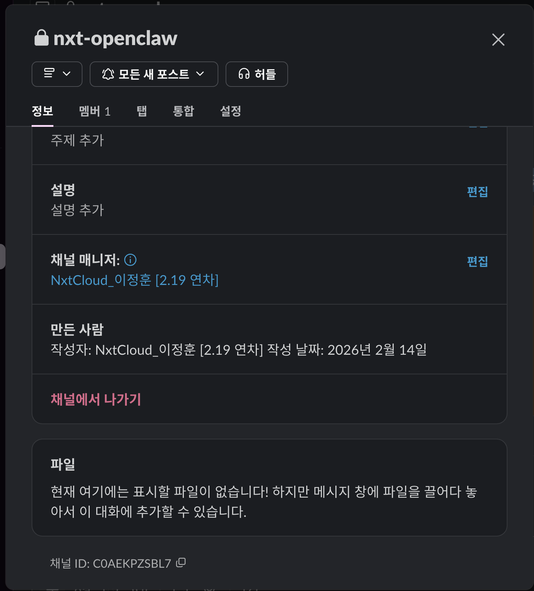

```
◇  Allowed channel IDs (comma-separated)
│  <CHANNEL_ID>
```

> **참고**: `missing_scope` 경고가 표시될 수 있으나, 채널 ID는 정상적으로 등록된다.

---

## 9단계: Hooks 설정

Hooks는 Gateway 이벤트에 반응하여 자동으로 실행되는 기능이다.

### 활성화한 Hooks

교육용 환경에서 점검에 유용한 3가지 hook을 활성화한다:

| Hook | 역할 |
|------|------|
| boot-md | Gateway 시작 시 `BOOT.md` 파일의 지시사항을 에이전트에 전달 |
| bootstrap-extra-files | workspace에 추가 부트스트랩 파일 자동 로드 |
| command-logger | 모든 명령어 실행 이벤트를 감사 로그로 기록 |

### CLI로 Hook 활성화

```bash
openclaw hooks enable boot-md
openclaw hooks enable bootstrap-extra-files
openclaw hooks enable command-logger
```

### 활성화 확인

```bash
openclaw hooks list
```

```
Hooks (4/4 ready)
┌──────────┬───────────────────────┬───────────────────────────────────────────┬────────────────┐
│ Status   │ Hook                  │ Description                               │ Source         │
├──────────┼───────────────────────┼───────────────────────────────────────────┼────────────────┤
│ ✓ ready  │ 🚀 boot-md            │ Run BOOT.md on gateway startup            │ openclaw-bundled│
│ ✓ ready  │ 📎 bootstrap-extra-   │ Inject additional workspace bootstrap     │ openclaw-bundled│
│          │ files                 │ files via glob/path patterns              │                │
│ ✓ ready  │ 📝 command-logger     │ Log all command events to a centralized   │ openclaw-bundled│
│          │                       │ audit file                                │                │
│ ✓ ready  │ 💾 session-memory     │ Save session context to memory when /new  │ openclaw-bundled│
│          │                       │ command is issued                         │                │
└──────────┴───────────────────────┴───────────────────────────────────────────┴────────────────┘
```

> **참고**: `session-memory`는 활성화하지 않았으나, 필요 시 `openclaw hooks enable session-memory`로 추가할 수 있다.

---

## 10단계: AI 모델 인증 (구독 계정 OAuth)

OpenClaw는 Anthropic API 키 대신 **구독 계정(Pro/Max)**의 OAuth 토큰을 사용할 수 있다.

### 10-1. Claude Code에서 Setup Token 생성

Claude Code CLI가 설치된 로컬 머신에서 장기 인증 토큰을 발급한다:

```bash
claude setup-token
```

- 브라우저가 열리며 Anthropic 계정으로 로그인/승인
- 승인 완료 후 **1년 유효한 OAuth 토큰**(`sk-ant-oat01-...`)이 생성됨

> **참고**: headless 환경(SSH 등)에서는 TTY가 필요하다. `expect`를 사용하면 pseudo-TTY를 제공할 수 있다.

```
✓ Long-lived authentication token created successfully!

Your OAuth token (valid for 1 year):
sk-ant-oat01-****  (마스킹됨)

Store this token securely. You won't be able to see it again.
Use this token by setting: export CLAUDE_CODE_OAUTH_TOKEN=<token>
```

### 10-2. EC2의 OpenClaw에 토큰 등록

발급받은 토큰을 OpenClaw 설정에 등록한다:

```bash
openclaw config set env.vars.ANTHROPIC_API_KEY "sk-ant-oat01-..."
```

### 10-3. 기본 모델 설정

```bash
openclaw config set agents.defaults.model.primary "anthropic/claude-sonnet-4-5"
```

> **보안**: OAuth 토큰은 API 키와 동일하게 취급한다. `openclaw.json`에 저장되므로 파일 권한을 `600`으로 설정한다.

### API 키 vs 구독 OAuth 토큰

| 항목 | API 키 | 구독 OAuth 토큰 |
|------|--------|----------------|
| 접두사 | `sk-ant-api03-...` | `sk-ant-oat01-...` |
| 발급 | console.anthropic.com | `claude setup-token` |
| 과금 | API 사용량 기반 | 구독 요금에 포함 |
| 유효기간 | 무제한 (수동 해지) | 1년 |

---

## 11단계: Gateway 시작

### 11-1. Gateway 서비스 설치

systemd 서비스로 설치하면 EC2 재시작 시에도 자동 실행된다:

```bash
openclaw gateway install
```

```
Installed systemd service: ~/.config/systemd/user/openclaw-gateway.service
```

### 11-2. Gateway 시작

```bash
systemctl --user start openclaw-gateway.service
```

### 11-3. 상태 확인

```bash
openclaw gateway status
```

```
Service: systemd (enabled)
Gateway: bind=loopback (127.0.0.1), port=18789
Runtime: running (pid 7240, state active)
RPC probe: ok
```

### 11-4. 시작 로그 확인

```bash
systemctl --user status openclaw-gateway.service
```

주요 로그:

```
[hooks:loader] Registered hook: boot-md -> gateway:startup
[hooks:loader] Registered hook: bootstrap-extra-files -> agent:bootstrap
[hooks:loader] Registered hook: command-logger -> command
[hooks] loaded 4 internal hook handlers
[slack] [default] starting provider
[slack] socket mode connected
```

`socket mode connected` — Slack 연결 성공.

### 11-5. Doctor 확인

```bash
openclaw doctor --fix
```

---

## 설정 완료 상태 요약

### 최종 설정 (`~/.openclaw/openclaw.json`)

| 항목 | 설정값 |
|------|--------|
| Gateway 포트 | 18789 |
| Gateway 바인딩 | loopback (127.0.0.1) |
| Gateway 인증 | Token |
| AI 모델 | anthropic/claude-sonnet-4-5 |
| AI 인증 | OAuth 토큰 (구독 계정) |
| Slack 모드 | Socket Mode |
| 채널 정책 | Allowlist |
| 허용 채널 | <CHANNEL_ID> |
| Hooks | boot-md, bootstrap-extra-files, command-logger |
| Gateway 서비스 | systemd (enabled) |

### 남은 작업

- [x] AI 모델 인증 설정
- [x] Gateway 시작 및 연결 확인
- [x] Slack 메시지 송수신 테스트
- [x] Dashboard 접속 확인

---

## 12단계: Slack 메시지 테스트

### 12-1. DM 메시지 보내기

Slack에서 **nxt-openclaw** 앱을 찾아 DM을 보낸다.

### 12-2. 문제: "메시지를 보내는 기능이 꺼져 있습니다"

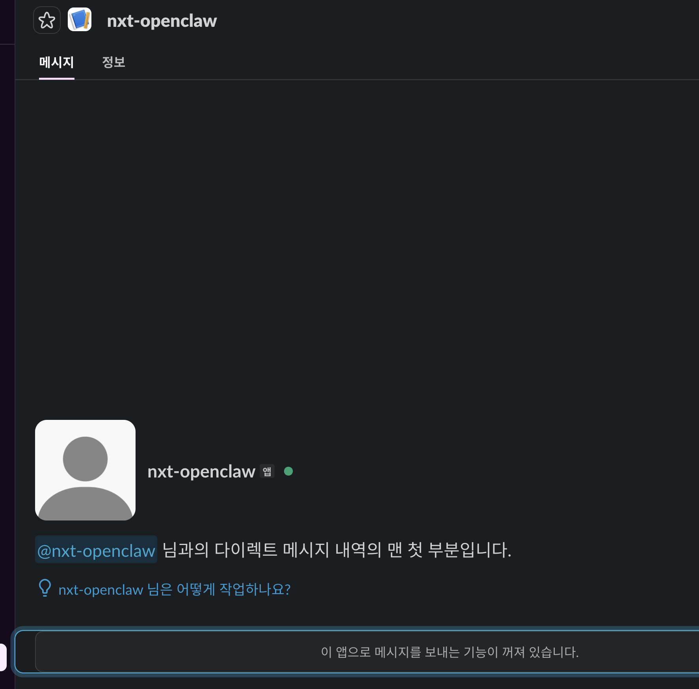

봇의 DM 입력창이 비활성화되어 있다면, Slack 앱 설정에서 **App Home**의 Messages Tab을 활성화해야 한다.

**해결**: https://api.slack.com/apps → **Features > App Home** → **Messages Tab** 활성화 + **"Allow users to send Slash commands and messages from the messages tab"** 체크

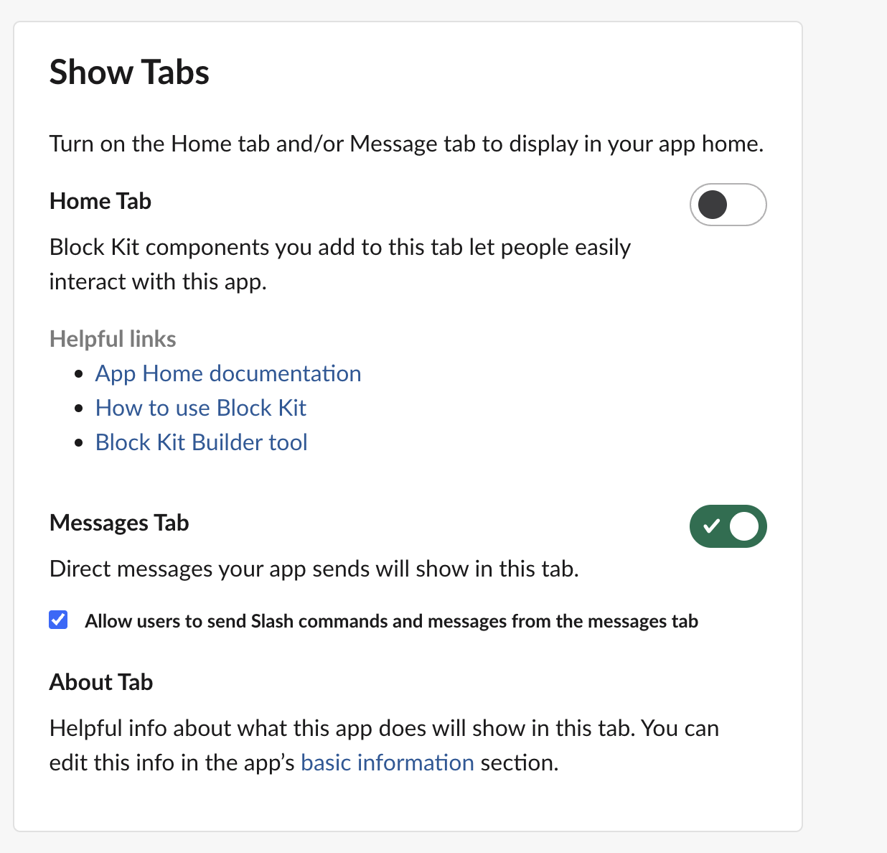

> **참고**: 이 설정은 보완된 매니페스트의 `app_home.messages_tab_enabled: true`에 해당한다. 매니페스트로 앱을 생성했다면 자동 적용되지만, 누락된 경우 수동 설정이 필요하다.

### 12-3. 문제: Pairing 요구

첫 DM 전송 시 봇이 **pairing code**를 반환한다:

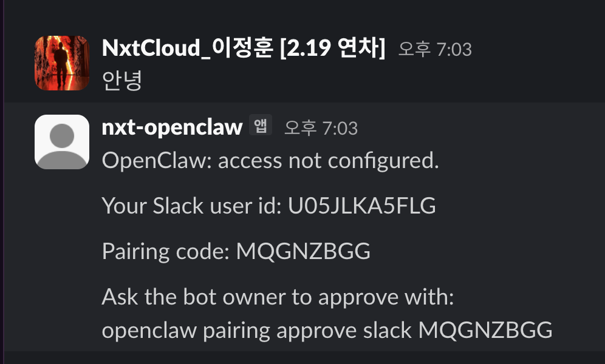

```
OpenClaw: access not configured.
Your Slack user id: <USER_ID>
Pairing code: <PAIRING_CODE>
Ask the bot owner to approve with:
  openclaw pairing approve slack <PAIRING_CODE>
```

OpenClaw는 보안상 DM 사용자를 사전 승인(pairing)해야 한다. EC2에서 승인:

```bash
openclaw pairing approve slack <PAIRING_CODE>
```

```
Approved slack sender <USER_ID>.
```

### 12-4. 문제: 응답 실패 (`missing_scope`)

페어링 후에도 봇이 응답하지 않는 경우, Gateway 로그를 확인한다:

```bash
journalctl --user -u openclaw-gateway.service --no-pager -n 20
```

```
[slack] final reply failed: Error: An API error occurred: missing_scope
```

온보딩 자동 생성 매니페스트에 `im:write` scope가 누락되어 DM 응답을 보낼 수 없었다.

**해결**:
1. Slack API → **OAuth & Permissions** → Bot Token Scopes에 `im:write`, `im:read` 추가
2. 상단 **"Reinstall your app"** 클릭하여 앱 재설치
3. EC2에서 Gateway 재시작:

```bash
systemctl --user restart openclaw-gateway.service
```

### 12-5. 동작 확인

scope 추가 및 Gateway 재시작 후, Slack DM에서 봇이 정상 응답하는 것을 확인.

---

## 13단계: Dashboard 접속

### 13-1. SSH 터널 설정

Gateway는 loopback(127.0.0.1)에만 바인딩되어 있어 외부에서 직접 접근이 불가하다. SSH 포트포워딩을 사용한다:

```bash
ssh -i ~/.ssh/glen-openclaw.pem -L 18789:127.0.0.1:18789 ubuntu@<EC2_ELASTIC_IP> -N
```

### 13-2. 브라우저에서 접속

Gateway 인증 토큰을 URL에 포함하여 접속한다:

```
http://localhost:18789/?token=<GATEWAY_TOKEN>
```

Gateway 토큰 확인:

```bash
openclaw config get gateway.auth.token
```

### 13-3. 문제: "gateway token missing"

토큰 없이 접속하면 인증 오류가 표시된다:

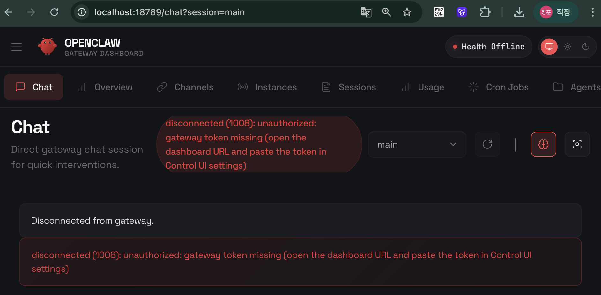

```
disconnected (1008): unauthorized: gateway token missing
(open the dashboard URL and paste the token in Control UI settings)
```

**해결**: URL에 `?token=<값>`을 추가하거나, 대시보드 설정에서 토큰을 붙여넣는다.

### 13-4. Dashboard 탭

| 탭 | 용도 |
|------|------|
| Chat | Gateway 직접 대화 |
| Overview | 시스템 상태 요약 |
| Channels | Slack 등 채널 상태 |
| Instances | 실행 중인 에이전트 |
| Sessions | 대화 세션 목록 |
| Usage | 토큰 사용량 |
| Cron Jobs | 예약 작업 |
| Agents | 에이전트 관리 |

---

## 트러블슈팅 요약

| 증상 | 원인 | 해결 |
|------|------|------|
| DM 입력창 비활성화 | App Home Messages Tab 꺼짐 | Slack API > App Home에서 활성화 |
| Pairing code 반환 | 사용자 미승인 | `openclaw pairing approve slack <코드>` |
| 봇 응답 없음 (로그: `missing_scope`) | `im:write` scope 누락 | OAuth scope 추가 후 앱 재설치 |
| Dashboard 접속 불가 | loopback 바인딩 | SSH 터널 `-L 18789:127.0.0.1:18789` |
| Dashboard "token missing" | Gateway 인증 토큰 누락 | URL에 `?token=<값>` 추가 |

---

## 설치 후 확인 명령어

```bash
openclaw doctor         # 설정 문제 확인
openclaw hooks list     # Hook 상태 확인
openclaw gateway status # Gateway 상태
openclaw dashboard      # 브라우저 UI (Control UI)
```

## 주요 경로

| 경로 | 용도 |
|------|------|
| `~/.openclaw/openclaw.json` | 설정 파일 |
| `~/.openclaw/workspace` | 스킬, 프롬프트, 메모리 |
| `~/.openclaw/workspace/BOOT.md` | Gateway 시작 시 실행할 지시사항 |
| `~/.openclaw/credentials/` | 인증 정보 |
| `~/.openclaw/logs/` | 감사 로그 (command-logger) |
| `/tmp/openclaw/` | 런타임 로그 |
