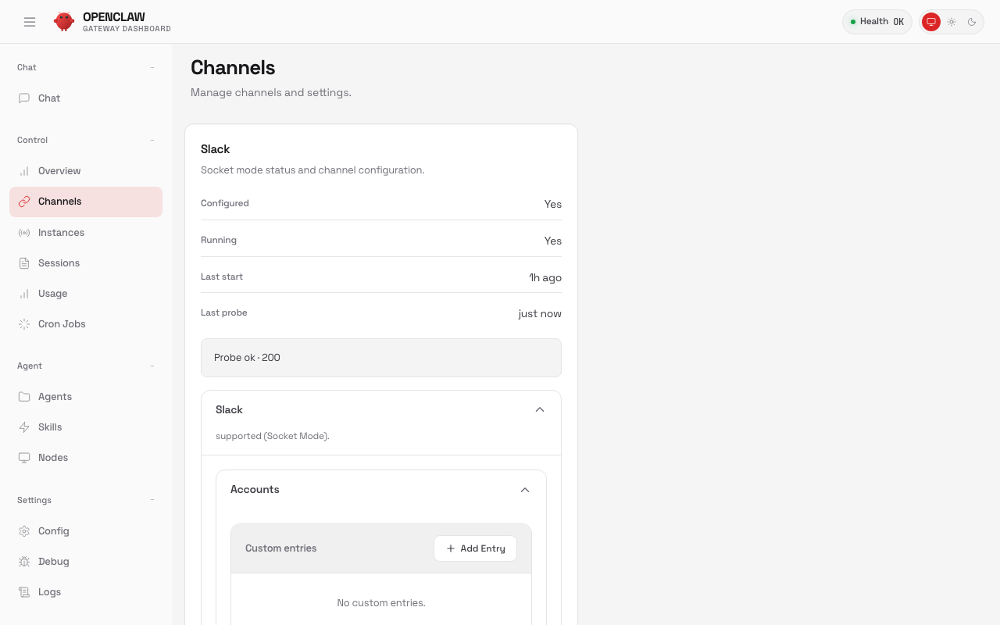
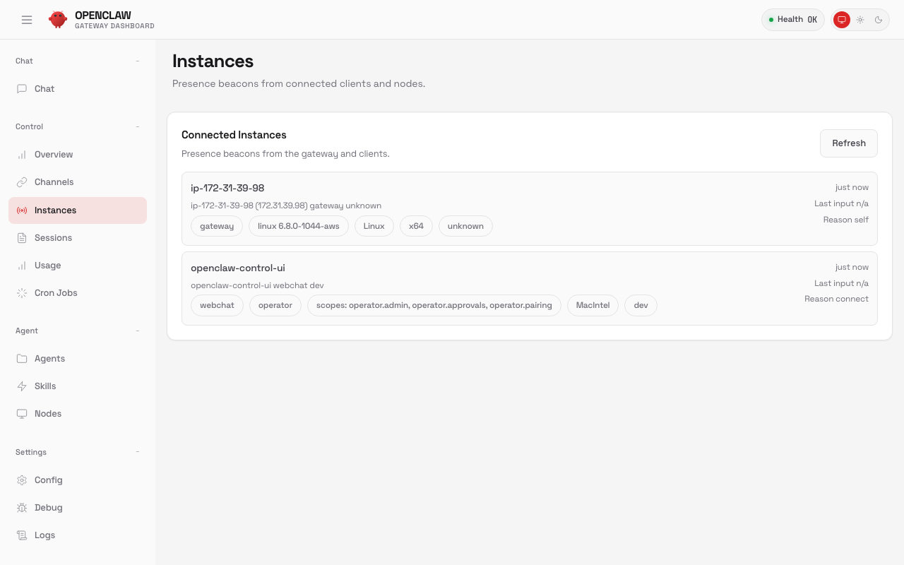
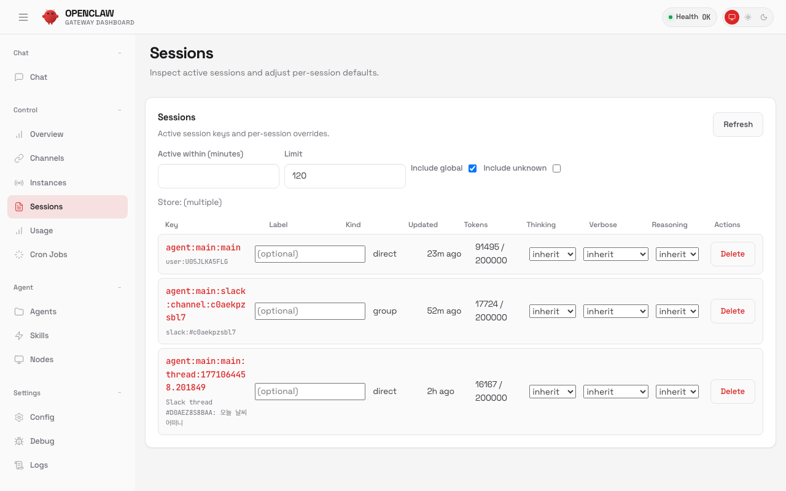
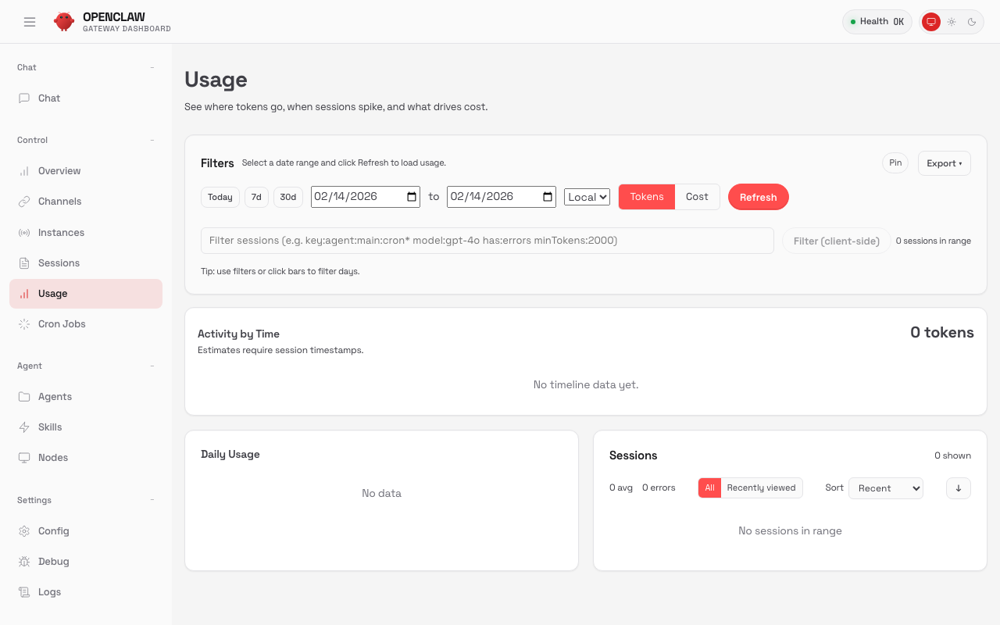
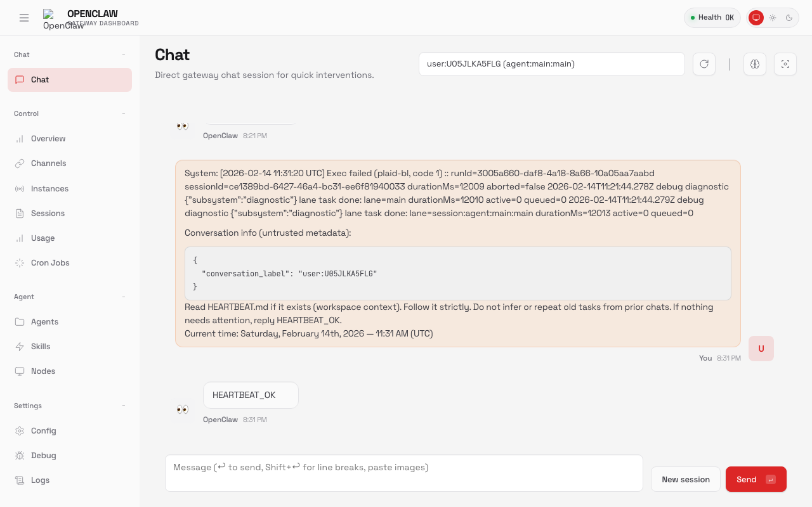
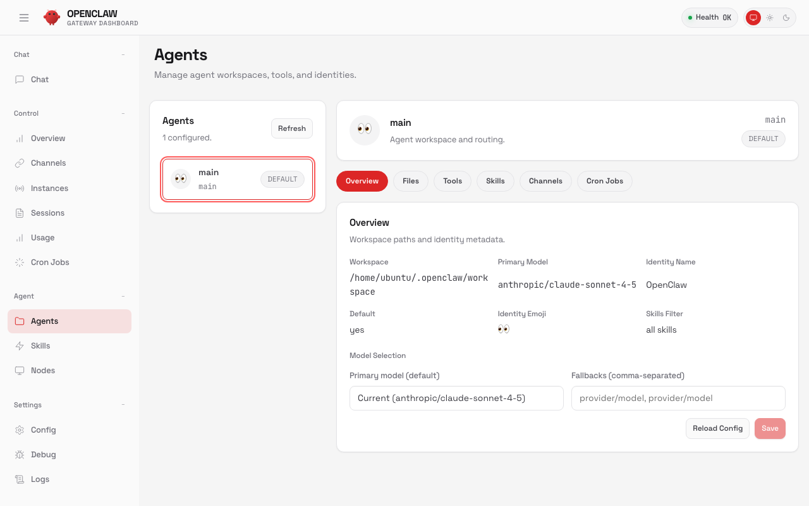

# 03. 대시보드 가이드

OpenClaw Control UI(대시보드)의 각 탭을 상세히 설명한다.

## 접속 방법

Gateway는 loopback(127.0.0.1)에 바인딩되어 있으므로 SSH 터널을 사용한다:

```bash
# 로컬 PC에서 SSH 터널 열기
ssh -i ~/.ssh/glen-openclaw.pem -L 18789:127.0.0.1:18789 ubuntu@<EC2_ELASTIC_IP> -N
```

브라우저에서 접속:

```
http://localhost:18789/?token=<GATEWAY_TOKEN>
```

Gateway 토큰 확인:

```bash
openclaw config get gateway.auth.token
```

> **참고**: 토큰 없이 접속하면 `unauthorized: gateway token missing` 오류가 발생한다. URL 파라미터로 토큰을 전달하거나, 대시보드 설정에서 입력한다.

---

## 탭 구성

대시보드는 8개 탭으로 구성되어 있다:

| 탭 | 주요 기능 |
|----|----------|
| **Chat** | Gateway와 직접 대화 |
| **Overview** | 시스템 상태 요약 |
| **Channels** | 채널 연결 상태/관리 |
| **Instances** | 에이전트 인스턴스 모니터링 |
| **Sessions** | 대화 세션 관리 |
| **Usage** | 토큰 사용량/비용 추적 |
| **Cron Jobs** | 예약 작업 관리 |
| **Agents** | 에이전트 설정/프로필 |

---

## Chat


Gateway에 직접 메시지를 보내는 대화 인터페이스.

### 용도

- 메신저 없이 브라우저에서 바로 AI와 대화
- 설정 테스트 및 디버깅
- 스킬 검색/설치 요청

### 주요 기능

- **메시지 입력**: 하단 입력창에 텍스트를 입력하면 AI가 응답
- **Thinking 모드**: `/thinking high`로 깊은 추론 활성화
- **세션 초기화**: `/reset`으로 대화 기록 초기화
- **모델 변경**: `/model claude-opus-4-6`으로 모델 전환

### 활용 팁

- 데스크탑 작업 시 브라우저 탭으로 열어두면 편리
- 복잡한 질문은 `/thinking high` 후 질문하면 정확도 향상
- 파일 작업을 요청하면 서버의 파일 시스템에 직접 접근 가능

---

## Overview


시스템 전체 상태를 한눈에 파악하는 대시보드.

### 표시 정보

- **Gateway 상태**: 실행 중/중지, 포트, 바인딩 주소
- **AI 모델**: 현재 설정된 모델 및 인증 상태
- **채널 요약**: 연결된 채널 수, 활성 상태
- **리소스 사용량**: 메모리, 디스크 사용 현황
- **최근 활동**: 마지막 메시지, 세션 수

### 활용 팁

- 매일 한 번 확인하면 시스템 이상을 조기 발견 가능
- 채널 상태가 `inactive`로 표시되면 해당 채널 설정 점검 필요

---

## Channels



연결된 메신저 채널의 상태를 확인하고 관리한다.

### 표시 정보

- **채널별 상태**: active / inactive / error
- **연결된 사용자 수**: 페어링된 사용자 목록
- **마지막 활동 시간**: 채널별 최근 메시지 타임스탬프

### 주요 기능

- 채널 활성화/비활성화
- 페어링 대기 중인 사용자 승인
- 채널별 설정 변경 (멘션 필수 여부, 허용 그룹 등)

### CLI 대응 명령어

```bash
# 채널 상태 확인
openclaw channels status

# 상세 진단
openclaw channels status --probe

# 페어링 승인
openclaw pairing approve <채널> <코드>
```

---

## Instances



현재 실행 중인 에이전트 인스턴스 목록과 상태를 보여준다.

### 표시 정보

- **인스턴스 ID**: 각 에이전트의 고유 식별자
- **상태**: running / idle / stopped
- **사용 모델**: 인스턴스별 AI 모델
- **메모리 사용량**: 에이전트별 리소스 소비

### 활용 팁

- 인스턴스가 많아지면 리소스 사용량이 증가하므로 불필요한 인스턴스는 정리
- idle 상태인 인스턴스는 자동으로 리소스를 반환

---

## Sessions



모든 대화 세션 목록을 관리한다.

### 표시 정보

- **세션 ID**: 고유 식별자
- **채널**: 어떤 채널에서 시작된 세션인지 (Slack, Telegram, Chat UI 등)
- **사용자**: 세션 참여자
- **메시지 수**: 누적 대화 수
- **마지막 활동**: 최근 대화 시간
- **상태**: active / archived

### 주요 기능

- 세션 상세 보기 (대화 내용 조회)
- 세션 아카이브/삭제
- 세션 내보내기

### CLI 대응 명령어

```bash
# 세션 목록
openclaw sessions list

# 세션 기록
openclaw sessions history
```

### 활용 팁

- 오래된 세션은 아카이브하여 컨텍스트 윈도우 정리
- DM과 그룹 채팅은 별도 세션으로 생성됨

---

## Usage



토큰 사용량과 비용을 추적한다.

### 표시 정보

- **일별/주별/월별 토큰 사용량**: 입력/출력 토큰 분리
- **모델별 사용량**: 모델(Claude Sonnet, Opus 등)별 소비 현황
- **비용 추정**: 구독 기준 사용률 또는 API 기준 비용
- **사용 추세**: 시간대별 사용 패턴 그래프

### 활용 팁

- 사용량이 급증하면 불필요한 긴 대화 세션을 `/reset`으로 정리
- thinking 모드(`/thinking high`)는 토큰 소비가 크므로 필요할 때만 사용
- 구독 한도에 가까워지면 가벼운 모델로 전환 (`/model claude-sonnet-4-5`)

### CLI 대응 명령어

```bash
openclaw usage
```

---

## Cron Jobs



예약 작업(스케줄 작업)을 설정하고 관리한다.

### 용도

- 정기적인 요약 보고서 생성
- 매일 아침 브리핑 메시지 전송
- 주기적인 웹 페이지 모니터링
- 데이터 수집 및 정리 자동화

### 주요 기능

- **작업 생성**: 스케줄(cron 표현식)과 실행할 메시지/명령 설정
- **작업 목록**: 등록된 cron job 목록 및 다음 실행 시간
- **실행 이력**: 과거 실행 결과 및 로그
- **활성화/비활성화**: 개별 작업 토글

### 활용 팁

- cron 표현식 예: `0 9 * * *` (매일 오전 9시)
- 작업이 실패하면 실행 이력에서 오류 로그를 확인

---

## Agents



에이전트 프로필과 설정을 관리한다.

### 표시 정보

- **에이전트 목록**: 등록된 에이전트 프로필
- **기본 모델**: 에이전트별 AI 모델 설정
- **시스템 프롬프트**: 에이전트의 성격/역할 정의
- **도구 권한**: 활성화된 도구(파일 접근, 브라우저, 명령 실행 등)
- **메모리**: 에이전트의 영구 메모리 내용

### 주요 기능

- 에이전트 프로필 생성/편집
- 모델 변경 및 시스템 프롬프트 수정
- 도구 권한 관리 (샌드박스 설정)
- 메모리 조회/편집

### 활용 팁

- 용도별 에이전트를 분리하면 효율적 (예: 코딩용, 일상 대화용)
- 시스템 프롬프트에 역할을 명확히 정의하면 응답 품질 향상
- 도구 권한은 최소 권한 원칙(least privilege)으로 설정

---

## 참고

- [01-ec2-생성.md](./01-ec2-생성.md) — EC2 프로비저닝
- [02-openclaw-설치.md](./02-openclaw-설치.md) — OpenClaw 설치 및 Slack 연동
- [04-운영-레퍼런스.md](./04-운영-레퍼런스.md) — 운영 명령어, 트러블슈팅, 비용
